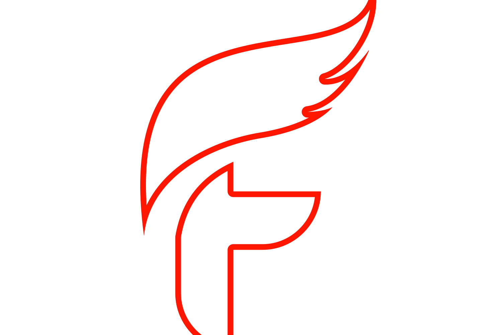
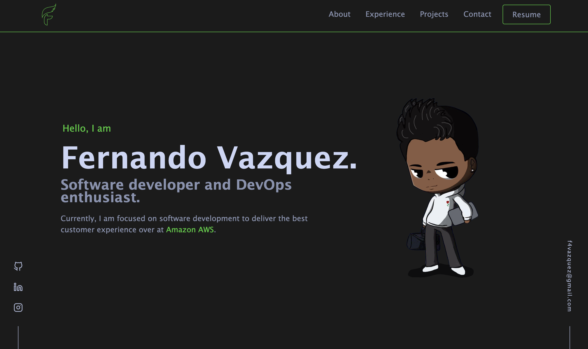

<div align="center">
  
  <h1>fernandovazquez.dev</h1>
  <p>
    The second iteration of <a href="https://fernandovazquez.dev/">fernandovazquez.dev</a>, hosted on 
    <a href="https://www.netlify.com">Netlify</a>, built with <a href="https://github.com/facebook/create-react-app">React</a>
  </p>
  <p align="center">
    Previous iteration:
    <a href="https://github.com/fevazquez/v1" target="_blank">v1</a>  
  </p>

[](https://app.netlify.com/sites/vigilant-elion-a37e60/deploys)
[](https://app.circleci.com/pipelines/github/fevazquez/v2?branch=dev&filter=all)




</div>

<br />

<!-- Table of Contents -->

# :notebook_with_decorative_cover: Table of Contents

- [About the Project](#star2-about-the-project)
  - [Tech Stack](#space_invader-tech-stack)
  - [Features](#dart-features)
  - [Color Reference](#art-color-reference)
- [Getting Started](#toolbox-getting-started)
  - [Run Locally](#running-run-locally)
- [Contact](#handshake-contact)
- [Acknowledgements](#gem-acknowledgements)

<!-- About the Project -->

## :star2: About the Project

<!-- TechStack -->

### :space_invader: Tech Stack

<details>
  <summary>Client</summary>
  <ul>
    <li><a href="https://reactjs.org/">React.js</a></li>
    <li><a href="https://getbootstrap.com">Bootstrap</a></li>
  </ul>
</details>

<details>
  <summary>Server</summary>
  <ul>
    <li><a href="https://www.netlify.com">Netlify</a></li>
  </ul>
</details>

<details>
<summary>DevOps</summary>
  <ul>
    <li><a href="https://www.docker.com/">Docker</a></li>
    <li><a href="https://circleci.com/">CircleCLI</a></li>
  </ul>
</details>

<!-- Color Reference -->

### :art: Color Reference

| Color           | Hex                                                              |
| --------------- | ---------------------------------------------------------------- |
| Primary Color   |  #1b1b1b |
| Secondary Color |  #141414 |
| Accent Color    |  #32cd32 |
| Text Color      |  #8892b0 |

<!-- Run Locally -->

### :running: Run Locally

Clone the project

```bash
  git clone https://github.com/fevazquez/v2.git
```

Go to the project directory

```bash
  cd my-project
```

Install dependencies

```bash
  npm install
```

Start the server

```bash
  npm start
```

Runs the app in the development mode.\
Open [http://localhost:3000](http://localhost:3000) to view it in your browser.

```bash
  npm test
```

Launches the test runner in the interactive watch mode.\
See the section about [running tests](https://facebook.github.io/create-react-app/docs/running-tests) for more information.

### `npm run build`

Builds the app for production to the `build` folder.\
It correctly bundles React in production mode and optimizes the build for the best performance.

The build is minified and the filenames include the hashes.

<!-- Contact -->

## :handshake: Contact

Fernando Vazquez - f4vazquez@gmail.com

Project Link: [fernandovazquez.dev](https://www.fernandovazquez.dev)

<!-- Acknowledgments -->

## :gem: Acknowledgements

- [brittanychiang.com](https://github.com/bchiang7/v4)
- [Shields.io](https://shields.io/)
- [Emoji Cheat Sheet](https://github.com/ikatyang/emoji-cheat-sheet/blob/master/README.md#travel--places)
- [Readme Template](https://github.com/Louis3797/awesome-readme-template)
